# ESP32 Hub75 DevKit

## 前言

目前大量的LED点阵屏均为Hub75接口如下图所示，想要驱动它的话需要占用13个IO引脚。而有的点阵比较多的LED屏则更是需要使用到14个引脚，即右排第四个针脚的GND改变为信号通道E，如图二所示。在做各种LED点阵屏相关实验时，如果使用杜邦线来连接这些针脚的话估计会让你眼花缭乱，接错或者没有接稳时更会让人头疼。

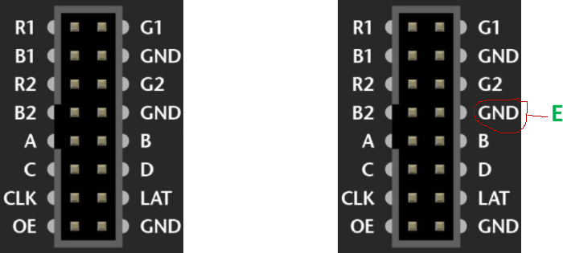

## ESP32 Hub75 Adapter 到 ESP32 Hub75 DevKit

所以之前曾经为乐鑫官方的ESP32开发板做过一个小的适配板，参见[ESP32 Hub75 Adapter](https://github.com/breakstring/esp32-hub75-adapter)这个项目。
但是依然会觉得不方便，一是ESP32开发板插到那个适配板上后体积会变得很大，二是整体并不美观。所以干脆重新参考乐鑫官方的[ESP32 DevKitC V4 开发板](https://docs.espressif.com/projects/esp-idf/zh_CN/release-v4.1/hw-reference/modules-and-boards.html#esp32-devkitc-v4)的[原理图](https://dl.espressif.com/dl/schematics/esp32_devkitc_v4-sch-20180607a.pdf)自己尝试制作了这款集成了用于Hub75/Hub75E的简牛插座的焊盘和TF卡卡槽的ESP32 Hub75 DevKit开发板。
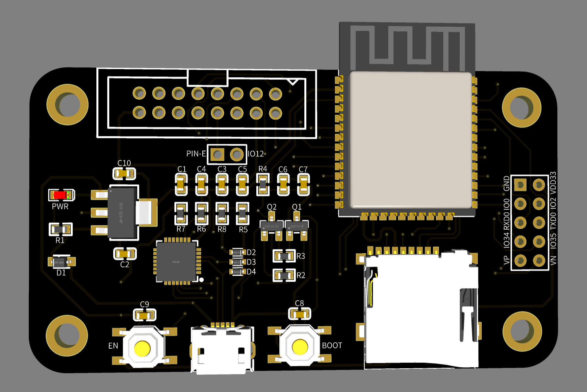
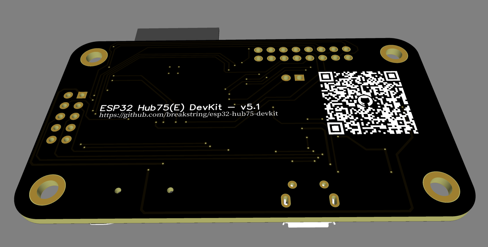

## 原理图

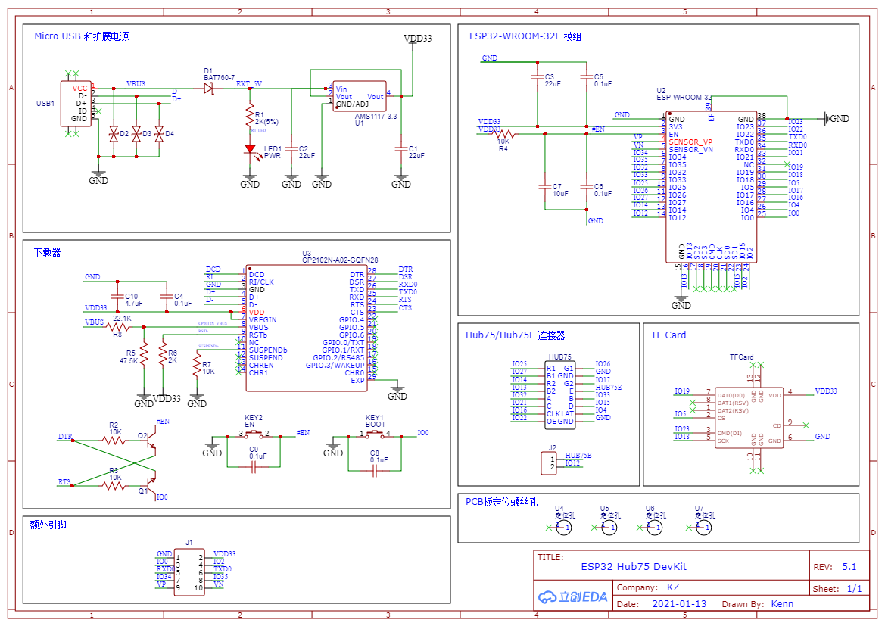

## 实物照片

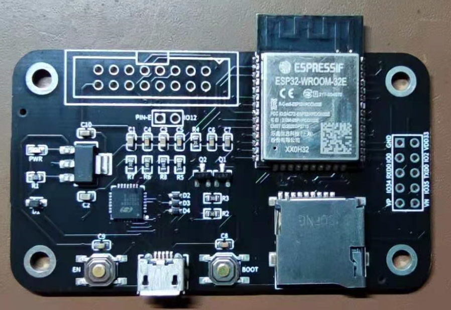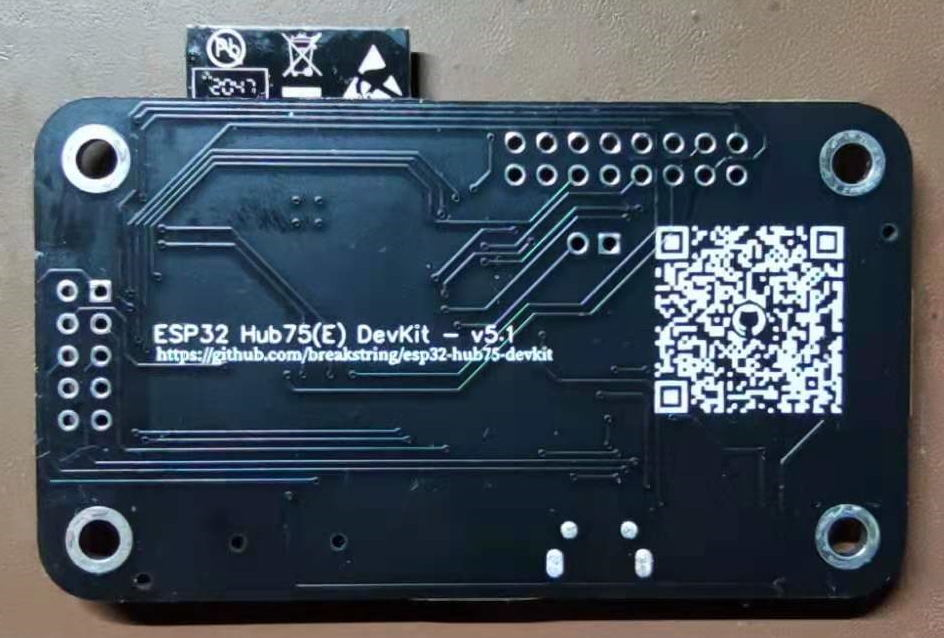

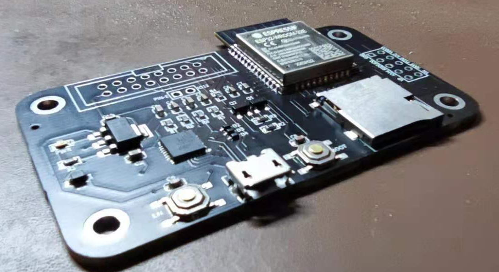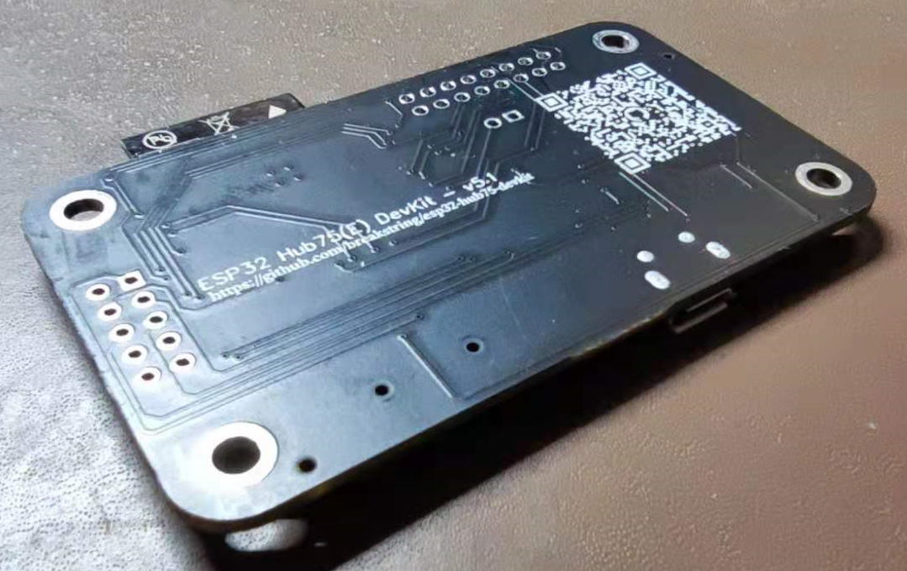

## BOM

您可以点击前往[此页面](https://breakstring.github.io/esp32-hub75-devkit/BOM_V5.1.html)交互式查看本开发板的具体BOM信息和布线参考。
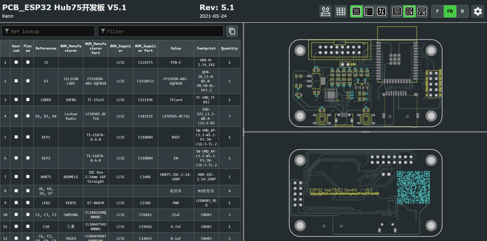

## 特点

此款开发板具有如下特点：

- 器件尽可能参考官方ESP32 DevKitC V4，保障其兼容性。
- 集成标准2.54的2*8焊盘，用于Hub75接口的简牛插座或者直母插座（这样可以根据实际需要使用不同的安装方式）。
- 集成TF卡卡槽。
- 通过跳线切换是否支持Hub75E，如果您的点阵屏是16刷的Hub75接口，则可以省出来IO12接口用于其他用途。
- 自带4个M3定位孔，便于固定需求。
- 相比之前的ESP32 Hub75 Adapter 去掉了电源接线柱，避免误接和干扰。
- 兼容[ESP32基于DMA方式的点阵屏驱动库](https://github.com/mrfaptastic/ESP32-HUB75-MatrixPanel-I2S-DMA)，刷新效率高，且支持多屏链接组合成大屏（[参见示例](https://github.com/breakstring/esp32-hub75-devkit/tree/main/samples/ChainedPanels)）。

## 点阵屏兼容性
参见[Wiki文章](https://github.com/breakstring/esp32-hub75-devkit/wiki/%E7%82%B9%E9%98%B5%E5%B1%8F%E5%85%BC%E5%AE%B9%E6%80%A7) 
## 使用方式

### 连接点阵屏

根据您的实际需求，您可以选择在板子上Hub75焊盘的位置正面焊接2*8的简牛插座使用排线直接连接到点阵屏上，如下图所示。

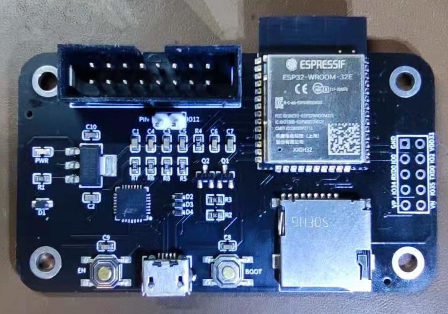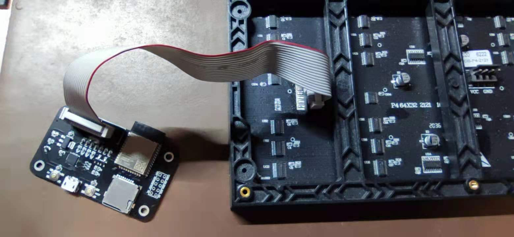

或者在背后焊接排针排母来把它直接插在点阵屏上,如下图所示：

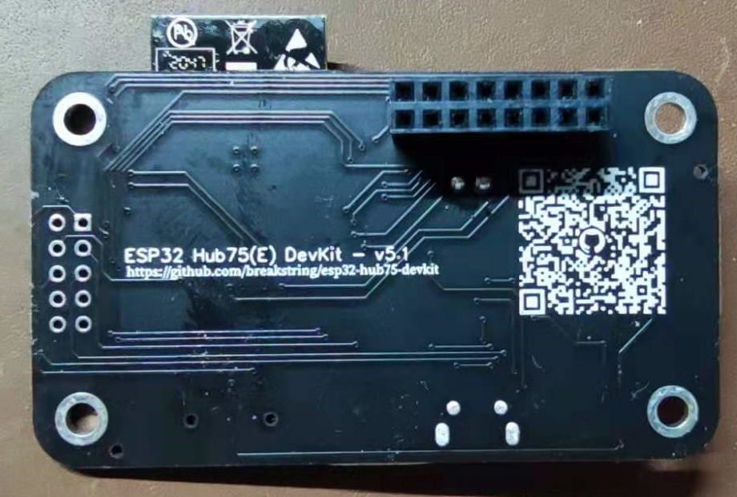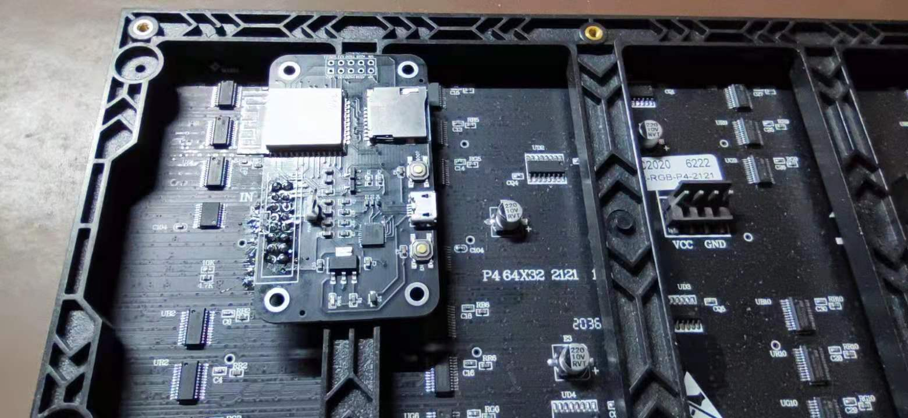

### E针脚

如果您使用的1/32刷的LED点阵屏（多见于64X64的），那么需要将Hub75焊盘下方的 PIN-E 焊盘和 IO12 焊盘连接起来。您也可以像我一样使用跳线帽来处理方便切换，或者根据需要直接焊接短路这两个焊盘。当然，如果您使用了上面提及的这个点阵屏驱动库，记得在代码中指定E针脚为IO12（32刷）或者-1（16刷）

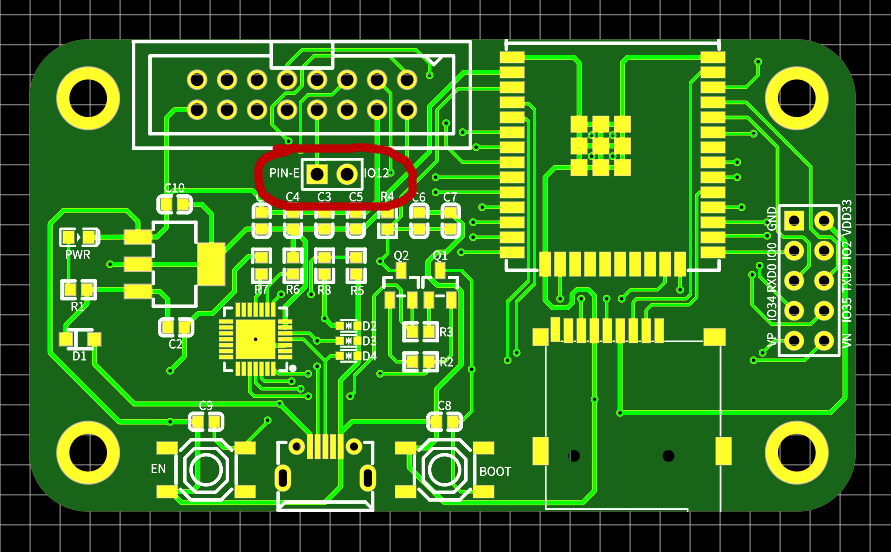

## 参考代码

参考代码均位于本Repo下 samples 目录下，目前也均从这个[ESP32基于DMA方式的点阵屏驱动库](https://github.com/mrfaptastic/ESP32-HUB75-MatrixPanel-I2S-DMA)的示例代码中移植而来。我的项目都是基于PlatformIO来做的，当然您直接用Arduino IDE应该也是可以很容易。您如果参考原始示例来写的话，需要注意下Hub75管脚的定义。尤其请注意阅读这两篇WiKi：

- [Arduino IDE和PlatformIO IDE的选择](https://github.com/breakstring/esp32-hub75-devkit/wiki/Arduino-IDE%E5%92%8CPlatformIO-IDE%E7%9A%84%E9%80%89%E6%8B%A9)
- [Hub75的引脚定义](https://github.com/breakstring/esp32-hub75-devkit/wiki/Hub75%E7%9A%84%E5%BC%95%E8%84%9A%E5%AE%9A%E4%B9%89)

